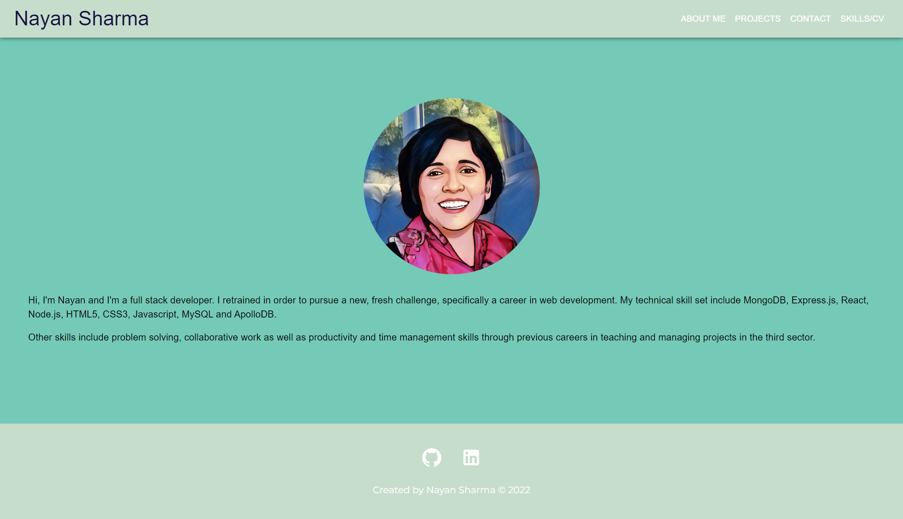
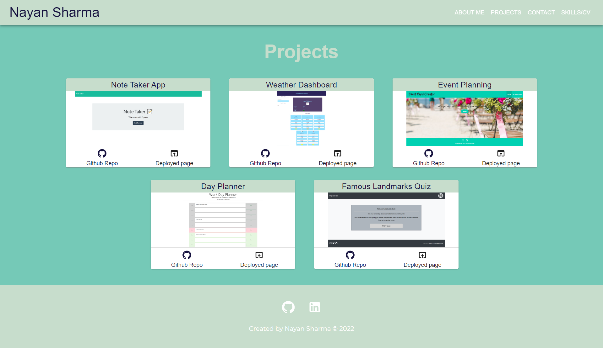
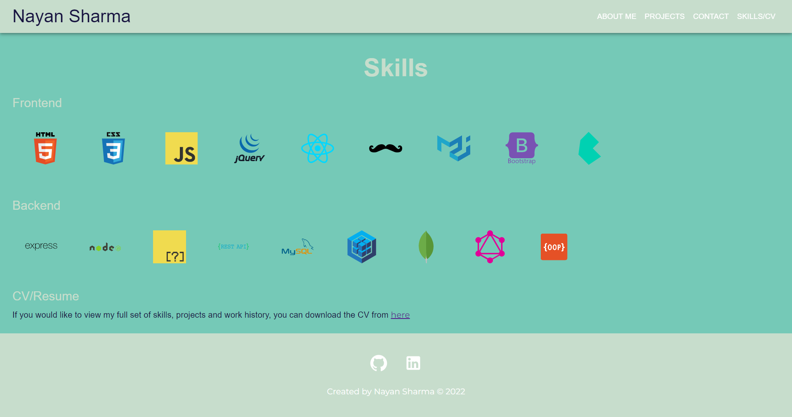

# Portfolio - Nayan Sharma 

A portfolio highlighting my skills and projects in this portfolio, built using React.

[Deployed URL](https://nsharma-uk.github.io/react-portfolio/)

## Table of content

- [Technologies](#technologies)
- [Screenshots of the application](#screenshots-of-the-application)
- [Contact me](#contact-me)

## Technologies

- React
- React-Hook-Form
- React-Router-DOM
- MaterialUI
- EmailJS
- GitHub Pages

## Screenshots

Landing Page/About Me

Projects

Skills

Contact

 
## Contact me

If you have any questions about the portfolio, please do get in touch by contacting me via [email](mailto:nsharmauk711@gmail.com).
